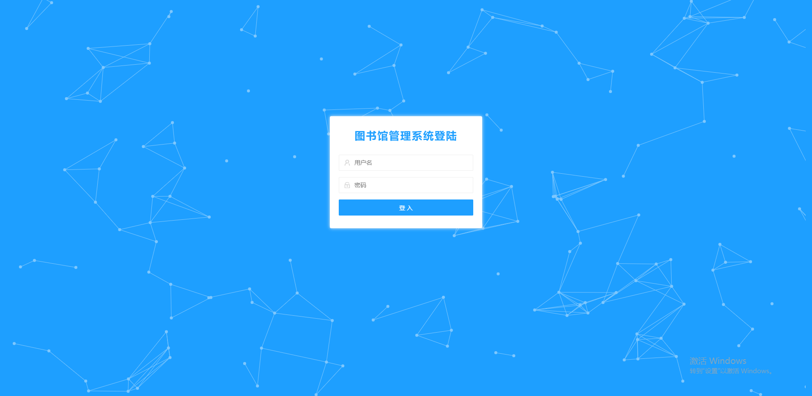
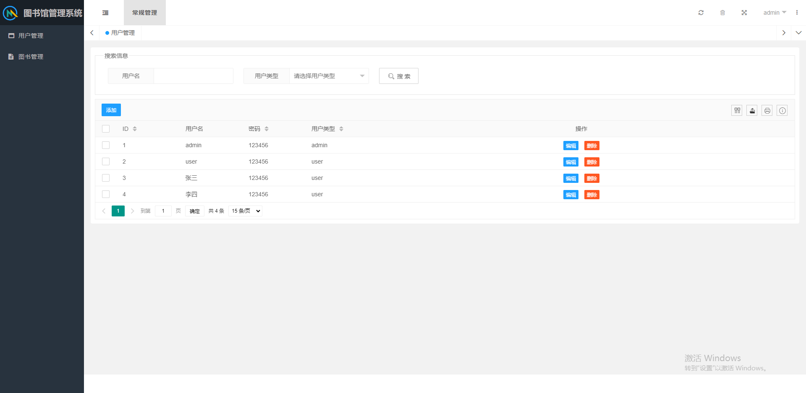
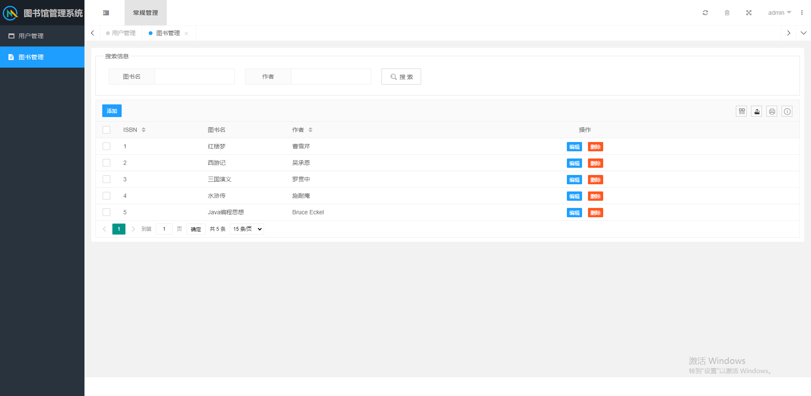
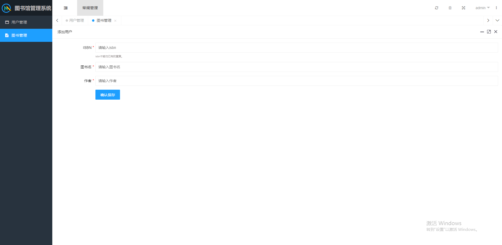
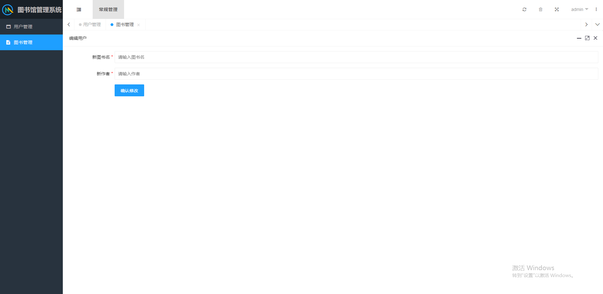
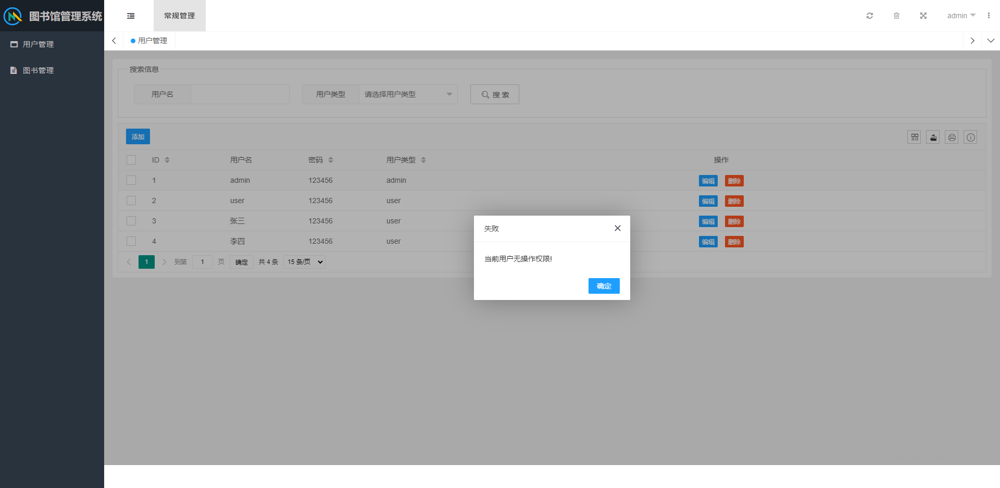

# 图书馆管理系统

## 简介
- 一个简单的图书馆管理系统，实现/具备以下基本功能：
  - 对用户和图书的增删改查功能
  - 用户登录和权限控制
    - 系统分两类用户（管理员和普通用户），管理员具备增删改查的所有权限，普通用户只能查
  - 缓存和数据库
  - swagger接口
  - 基于环境的配置分离
    - （有dev和prod两套配置，但实际上基本都一样。。。）
  - 日志：打印系统运行时的相关状态日志（初始化、抛异常等）
    - （最开始是想弄个日志系统之类的，大概就是建个表，记录系统运行、用户访问和操作等信息，并在前端展示，但是由于时间原因就没继续弄下去了，只做了简单打印。。。）

## 项目体验
(申请的免费云服务器，到期实例释放后会打不开。。。。)
- 演示地址：http://139.9.76.3:8080/index/login
  - 管理员登录：用户名=admin，密码=123456
  - 普通用户登录：用户名=user，密码=123456
- swagger接口UI：http://139.9.76.3:8080/swagger-ui.html

## 技术选型
- 后端框架：springboot
- 数据库：h2（基于内存）
- 缓存：redis
- 权限认证：shiro
- 前端模板：layuimini

## 使用说明
项目比较简单，基本没啥配置的。。。。
- 环境配置：java和redis
- 代码clone下来，修改配置文件中关于数据库和redis的配置，运行项目，访问 http://localhost:8080/index/login 即可，项目运行时会初始化admin和user两个用户

## 效果图

